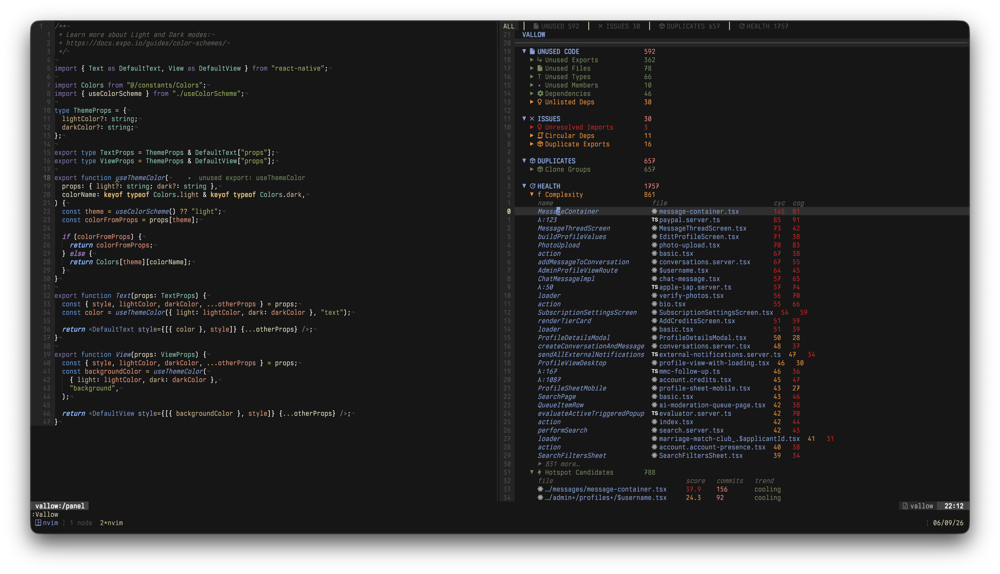

# vallow.nvim

fallow for Neovim. See your unused code, duplicates, and health in a native split.

Powered by [fallow](https://github.com/fallow-rs/fallow), a sub-second static analysis
engine for JS/TS. No tree-sitter, no LSP, no config needed on the Neovim side.



## Requirements

- Neovim >= 0.10
- [fallow](https://github.com/fallow-rs/fallow) CLI
- A TypeScript or JavaScript project with a `package.json`
- A [Nerd Font](https://www.nerdfonts.com/) if you want the icons (optional)

## Install

### [lazy.nvim](https://github.com/folke/lazy.nvim)

```lua
{
  "xeind/vallow.nvim",
  cmd = { "Vallow", "VallowRefresh", "VallowSearch" },
  keys = {
    { "<leader>V",  "<cmd>Vallow<cr>",        desc = "Vallow: toggle" },
    { "<leader>vr", "<cmd>VallowRefresh<cr>", desc = "Vallow: refresh" },
    { "<leader>vs", "<cmd>VallowSearch<cr>",  desc = "Vallow: search findings" },
  },
  opts = {},
}
```

### [packer.nvim](https://github.com/wbthomason/packer.nvim)

```lua
use {
  "xeind/vallow.nvim",
  config = function()
    require("vallow").setup()
  end,
}
```

## Install fallow

```sh
npm install -g fallow      # global (recommended)
npm install --save-dev fallow  # local to project
cargo install fallow       # or via Cargo
```

Local install:

```lua
require("vallow").setup({ fallow_cmd = "./node_modules/.bin/fallow" })
```

## Usage

| Command | What it does |
|---|---|
| `:Vallow` | Toggle the panel |
| `:VallowRefresh` | Re-run fallow and refresh |
| `:VallowSearch` | Search findings with telescope / fzf-lua / vim.ui.select |

Press `<CR>` on any issue to jump to the file and line.

## Panel keymaps

All remappable via `setup({ keymaps = ... })`.

| Key | Action |
|---|---|
| `<CR>` | Jump to file (edit in previous window) |
| `o` | Jump in horizontal split |
| `v` | Jump in vertical split |
| `t` | Jump in new tab |
| `L` / `H` | Next / previous tab (cycle sections) |
| `]c` / `[c` | Jump to next / previous section header |
| `<Tab>` / `za` | Toggle fold |
| `zo` / `zc` | Open / close fold |
| `zR` / `zM` | Open / close all folds |
| `K` | Detail float: path, name, kind, fix suggestions |
| `f` | Filter by path or name |
| `F` | Clear filter |
| `%` | Filter findings to the file under cursor |
| `gf` | Open picker (fuzzy search all findings) |
| `P` | Peek at file in floating window |
| `Q` | Send to quickfix |
| `y` | Yank path:line |
| `r` | Refresh |
| `q` | Close |
| `?` | Show keymap help |

## Panel structure

Sections and categories shown only when they have findings.

| Section | Categories |
|---|---|
| **UNUSED CODE** | Unused Exports, Types, Members, Files, Dependencies, Unlisted Deps |
| **ISSUES** | Unresolved Imports, Circular Deps, Duplicate Exports |
| **DUPLICATES** | Clone Groups |
| **HEALTH** | Complexity, Hotspots, Refactoring Targets |

Severity is color-coded: errors red, warnings yellow, hints grey.

## Configuration

```lua
require("vallow").setup({
  fallow_cmd  = "fallow",
  fallow_args = {},  -- extra CLI flags forwarded verbatim

  -- Which analyses to run. Remove entries to skip them entirely.
  analyses = { "dead-code", "dupes", "health" },

  window = {
    position = "right",  -- "bottom" | "top" | "left" | "right"
    size     = 0.5,
  },

  max_items = 30,  -- items per category before "N more..." expands

  diagnostics = {
    enabled  = true,
    severity = vim.diagnostic.severity.HINT,
  },

  statusline = {
    prefix = "vallow ",  -- " " for a Nerd Font icon
  },

  keymaps = {
    close        = "q",
    jump         = "<CR>",
    refresh      = "r",
    toggle_fold  = "<Tab>",
    next_tab     = "L",
    prev_tab     = "H",
    next_section = "]c",
    prev_section = "[c",
    filter       = "f",
    clear_filter = "F",
    pick         = "gf",
  },
})
```

### Statusline

```lua
-- lualine
require("lualine").setup({
  sections = {
    lualine_x = { { require("vallow").statusline, color = { fg = "#f9c74f" } } },
  },
})

-- raw
vim.o.statusline = "%"
```

Shows `vallow 42` when issues exist, `vallow ✓` when clean, empty when not run.

### Configuring fallow

vallow passes the project root to fallow. Configure fallow via `.fallowrc.json`:

```sh
fallow init
```

```jsonc
{
  "$schema": "https://raw.githubusercontent.com/fallow-rs/fallow/main/schema.json",
  "entry": ["src/index.ts"],
  "ignorePatterns": ["**/*.test.ts", "dist/**"],
  "ignoreDependencies": ["typescript"],
  "rules": {
    "unused-export": "error",
    "unused-file": "warn",
    "circular-dependency": "warn"
  }
}
```

Suppress findings inline:

```ts
// fallow-ignore-next-line unused-export
export function keepThisPublic() {}
```

## Highlight groups

All groups link to standard Neovim groups and work with any colorscheme.

| Group | Default | Used for |
|---|---|---|
| `VallowHeader` | `Title` | Panel title |
| `VallowSection` | `@keyword` | Section headers (UNUSED CODE, etc.) |
| `VallowBorder` | `FloatBorder` | Separator lines |
| `VallowPath` | `@string` | File paths |
| `VallowName` | `@function` | Export / symbol names |
| `VallowSymbol` | `@type` | Severity icons |
| `VallowKind` | `Comment` | Kind labels |
| `VallowCount` | `@number` | Issue counts |
| `VallowFooter` | `Comment` | Footer |
| `VallowLoading` | `WarningMsg` | Loading state |
| `VallowError` | `DiagnosticError` | Error state |
| `VallowSevError` | `DiagnosticError` | Error severity |
| `VallowSevWarn` | `DiagnosticWarn` | Warning severity |
| `VallowSevHint` | `DiagnosticHint` | Hint severity |
| `VallowTabActive` | `TabLineSel` | Active section tab |
| `VallowTabInactive` | `TabLine` | Inactive section tab |
| `VallowTabSep` | `TabLineFill` | Tab separator |

Override in your config:

```lua
vim.api.nvim_set_hl(0, "VallowHeader", { fg = "#bb9af7", bold = true })
```

## Contributing

```sh
git clone https://github.com/xeind/vallow.nvim
cd vallow.nvim
```

Point lazy.nvim at your clone for development:

```lua
{ dir = "~/path/to/vallow.nvim", opts = {} }
```

```
lua/vallow/
  init.lua          Public API
  config.lua        Defaults + deep merge
  health.lua        :checkhealth
  runner.lua        Async fallow -> output contract
  labels.lua        Shared label map
  diagnostics.lua   LSP-style inline diagnostics
  picker.lua        Telescope / fzf-lua / vim.ui.select
  panel/
    init.lua        Window lifecycle
    window.lua      Split buffer
    render.lua      Rendering + extmarks
    actions.lua     Keymaps
    highlights.lua  Highlight groups
    help.lua        Keymap reference popup
plugin/
  vallow.lua        :Vallow / :VallowRefresh / :VallowSearch
```

## License

[MIT](LICENSE)
