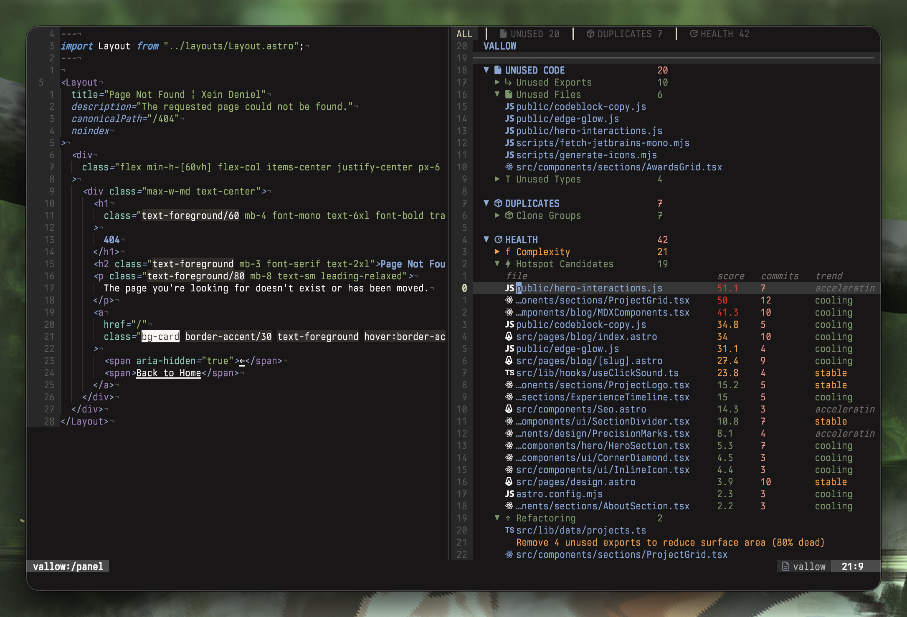

# vallow.nvim

fallow for Neovim. See your unused code, duplicates, and health in a native split.

Powered by [fallow](https://github.com/fallow-rs/fallow), a sub-second static analysis
engine for JS/TS. No tree-sitter, no LSP, no config needed on the Neovim side.



## Requirements

- Neovim >= 0.10
- [fallow](https://github.com/fallow-rs/fallow) CLI
- A TypeScript or JavaScript project with a `package.json`
- A [Nerd Font](https://www.nerdfonts.com/) if you want the icons (optional)
- [nvim-web-devicons](https://github.com/nvim-tree/nvim-web-devicons) for file icons in the panel (optional)

## Install

### [lazy.nvim](https://github.com/folke/lazy.nvim)

```lua
{
  "xeind/vallow.nvim",
  cmd = { "Vallow", "VallowRefresh", "VallowSearch" },
  keys = {
    { "<leader>V",  "<cmd>Vallow<cr>",        desc = "Vallow: toggle" },
    { "<leader>vr", "<cmd>VallowRefresh<cr>", desc = "Vallow: refresh" },
    { "<leader>vs", "<cmd>VallowSearch<cr>",  desc = "Vallow: search findings" },
  },
  opts = {},
}
```

## Install fallow

```sh
npm install -g fallow      # global (recommended)
npm install --save-dev fallow  # local to project
cargo install fallow       # or via Cargo
```

Or let vallow fetch the standalone binary:

```vim
:VallowInstall          " latest release into stdpath("data")/vallow/bin
:VallowInstall 3.22.0   " a specific version
:VallowInstall lsp      " fallow-lsp
:VallowUpdate           " latest again
```

The download uses `curl`. Release signatures (`.sig`) are published but vallow
does not verify them.

vallow looks for the binary in this order:

1. `fallow_cmd`, when you set it to something other than `"fallow"`
2. `<project>/node_modules/.bin/fallow`
3. `fallow` on `PATH`
4. `stdpath("data")/vallow/bin/fallow`
5. nothing found: vallow offers the download once per session

A local install therefore needs no configuration. To pin one explicitly:

```lua
require("vallow").setup({ fallow_cmd = "./node_modules/.bin/fallow" })
```

## Usage

| Command | What it does |
|---|---|
| `:Vallow` | Toggle the panel |
| `:Vallow health` | Open the panel on a section: `health`, `issues`, `duplicates`, `unused_code`, `architecture` |
| `:Vallow dashboard` | Health dashboard float: score gauge, penalties, vital signs, trend |
| `:Vallow audit [ref]` | Review the files changed since `ref` (default `main`, else `master`) |
| `:Vallow production` | Toggle production mode (test/dev files excluded) and re-run |
| `:Vallow refresh` | Re-run fallow and refresh |
| `:Vallow search` | Search findings |
| `:VallowRefresh` | Re-run fallow and refresh |
| `:VallowInspect` | Inspect the current file: exports, importers, findings, health |
| `:VallowSearch` | Search findings with snacks / telescope / fzf-lua / vim.ui.select |
| `:VallowInstall [lsp] [version]` | Download the fallow (or fallow-lsp) binary |
| `:VallowUpdate` | Download the latest fallow binary |

Press `<CR>` on any issue to jump to the file and line.

## Panel keymaps

All remappable via `setup({ keymaps = ... })`.

| Key | Action |
|---|---|
| `<CR>` | Jump to file (edit in previous window) |
| `o` | Jump in horizontal split |
| `v` | Jump in vertical split |
| `t` | Jump in new tab |
| `L` / `H` | Next / previous tab (cycle sections) |
| `]c` / `[c` | Jump to next / previous section header |
| `<Tab>` / `za` | Toggle fold |
| `zo` / `zc` | Open / close fold |
| `zR` / `zM` | Open / close all folds |
| `K` | Detail float: path, name, kind, fix suggestions, cycle chain |
| `f` | Filter by path or name |
| `F` | Clear filter |
| `%` | Filter findings to the file under cursor |
| `i` | Audit mode: hide findings the change inherited |
| `gi` | Inspect the file on this row |
| `x` | Ignore this finding: `.fallowrc.json` entry or suppression comment |
| `ge` | Explain this issue type (`fallow explain`) |
| `gt` | Trace an unused export or dependency |
| `d` | Diff the two largest instances of a clone group |
| `D` | Health dashboard float |
| `gf` | Open picker (fuzzy search all findings) |
| `P` | Peek at file in floating window (whole range for clones and functions) |
| `Q` | Send to quickfix |
| `y` | Yank path:line |
| `r` | Refresh |
| `q` | Close |
| `?` | Show keymap help |

## Panel structure

Sections and categories shown only when they have findings.

| Section | Categories |
|---|---|
| **UNUSED CODE** | Unused Exports, Types, Members, Files, Dependencies, Unlisted Deps |
| **ISSUES** | Unresolved Imports, Circular Deps, Duplicate Exports, Stale Suppressions |
| **DUPLICATES** | Clone Groups |
| **HEALTH** | Complexity, Hotspots, Refactoring Targets |
| **ARCHITECTURE** | Boundary Violations |

Severity is color-coded: errors red, warnings yellow, hints grey.

## Configuration

```lua
require("vallow").setup({
  fallow_cmd  = "fallow",
  fallow_args = {},  -- extra CLI flags forwarded verbatim
  timeout_ms  = 60000,  -- kill fallow after this long (type-aware pass can take 120 s)
  env         = {},  -- extra env for fallow, e.g. { FALLOW_TYPE_AWARE_TIMEOUT_SECS = "300" }

  -- Which analyses to run. Remove entries to skip them entirely.
  analyses = { "dead-code", "dupes", "health" },

  -- Reorder tabs. Omitted sections keep their default order after listed ones.
  -- section_order = { "health", "issues", "duplicates", "unused_code", "architecture" },

  window = {
    position = "right",  -- "bottom" | "top" | "left" | "right"
    size     = 0.5,
  },

  max_items = 30,  -- items per category before "N more..." expands
  auto_refresh = false,  -- re-run fallow silently on every JS/TS file save
  cache = true,  -- reopen with the last run's results, marked (stale), while fallow re-runs

  diagnostics = {
    enabled = true,
    virtual_text = true,  -- false hides the inline text, keeps signs and float
    current_buffer_only = false,  -- true limits diagnostics to the current buffer
    virtual_lines = false,  -- dim "ƒ cyclomatic N · cognitive M" above complex functions
    -- Per finding category: turn it off, or change its severity
    -- ("error" | "warn" | "info" | "hint").
    categories = {
      unused_exports     = { enabled = true, severity = "hint" },
      unresolved_imports = { enabled = true, severity = "error" },
      -- ... one entry per category, see :help vallow-config
    },
  },

  statusline = {
    prefix = "vallow ",  -- " " for a Nerd Font icon
  },

  -- Grey out unused files in the file explorers. Each explorer also needs a
  -- one-line hook in its own setup, see "File explorers" below.
  integrations = {
    nvim_tree = true,
    neo_tree  = true,
    oil       = true,
  },

  keymaps = {
    close        = "q",
    jump         = "<CR>",
    refresh      = "r",
    toggle_fold  = nil,  -- unset by default; za/zo/zc/zR/zM always work
    next_tab     = "L",
    prev_tab     = "H",
    next_section = "]c",
    prev_section = "[c",
    filter       = "f",
    clear_filter = "F",
    pick         = "gf",
  },
})
```

All highlight groups (`VallowHeader`, `VallowPath`, `VallowName`, `VallowSevError`, …)
link to standard Neovim groups and work with any colorscheme. Override as needed:

```lua
vim.api.nvim_set_hl(0, "VallowHeader", { fg = "#bb9af7", bold = true })
```

### Statusline

```lua
-- lualine
require("lualine").setup({
  sections = {
    lualine_x = { { require("vallow").statusline, color = { fg = "#f9c74f" } } },
  },
})

-- raw
vim.o.statusline = "%"
```

Shows `vallow 42` when issues exist, `vallow ✓` when clean, empty when not run.

### Lualine component

```lua
require("lualine").setup({
  sections = { lualine_x = { require("vallow").lualine() } },
})
```

Shows `vallow E:2 W:5 H:40`, coloured per severity with `VallowSevError`,
`VallowSevWarn`, and `VallowSevHint`. A spinner runs while fallow does,
`vallow ✓` means no findings, and `vallow !` means fallow failed.

### Picker extensions

```lua
-- telescope
require("telescope").load_extension("vallow")   -- then :Telescope vallow

-- snacks
Snacks.picker.vallow()                          -- or Snacks.picker("vallow")
```

Both list every finding with its category, `path:line`, and name, and preview
the file at the finding line. The snacks source registers itself when snacks is
loaded; if you load snacks later, call
`require("vallow.picker").register_snacks()` yourself. `:VallowSearch` and `gf`
keep working with snacks, telescope, fzf-lua, or `vim.ui.select`.

### File explorers

Files fallow reports as unused are greyed out with `VallowUnusedFile` (linked to
`Comment`). Each explorer reads its hooks from its own setup, so add one line there:

```lua
-- nvim-tree
require("nvim-tree").setup({
  renderer = {
    decorators = {
      "Git", "Open", "Hidden", "Modified", "Bookmark", "Diagnostics", "Copied", "Cut",
      require("vallow.integrations.nvim_tree").decorator,
    },
  },
})

-- neo-tree
require("neo-tree").setup({
  components = { name = require("vallow.integrations.neo_tree").name },
})

-- oil
require("oil").setup({
  view_options = { highlight_filename = require("vallow.integrations.oil").highlight_filename },
})
```

The decorations update after every fallow run and stay until the next one. Turn
any of them off with `integrations = { nvim_tree = false, neo_tree = false, oil = false }`.

vallow fires `User VallowResults` after each run, so you can hook your own code:

```lua
vim.api.nvim_create_autocmd("User", { pattern = "VallowResults", callback = function() ... end })
```

### Configuring fallow

vallow passes the project root to fallow. Configure fallow via `.fallowrc.json`:

```sh
fallow init
```

```jsonc
{
  "$schema": "https://raw.githubusercontent.com/fallow-rs/fallow/main/schema.json",
  "entry": ["src/index.ts"],
  "ignorePatterns": ["**/*.test.ts", "dist/**"],
  "ignoreDependencies": ["typescript"],
  "rules": {
    "unused-export": "error",
    "unused-file": "warn",
    "circular-dependency": "warn"
  }
}
```

Suppress findings inline:

```ts
// fallow-ignore-next-line unused-export
export function keepThisPublic() {}
```


## Development

Tests run headless against a fixture project in `tests/fixture/`. They need
`fallow` on PATH.

```sh
make test   # headless harness: runner, panel render, error path
make lint   # stylua --check lua
```


## License

[MIT](LICENSE)
